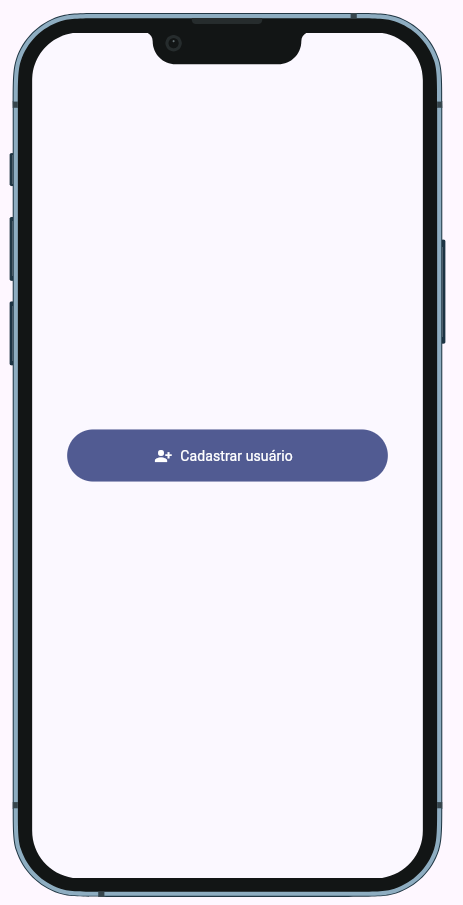

# Flutter Navigator Demo

Aplicativo desenvolvido em Flutter para demonstrar os principais recursos do **Navigator**, utilizando:

- Navigator.pushNamed()
- Navigator.pop()
- Navigator.popUntil()
- Navigator.pushReplacementNamed()

Além disso, o projeto implementa gerenciamento de estado com:

- ChangeNotifier
- GetIt (Service Locator)

---

## 📱 Demonstração

O aplicativo é composto por três telas:

### 🏠 Início

Tela inicial contendo um botão para abrir o formulário de cadastro.

<p align="center">
  
</p>

### 📝 Cadastro

Tela responsável por coletar as seguintes informações:

- Nome
- E-mail
- Receber notificações (Sim ou Não)

<p align="center">
  
</p>

Ao clicar em **Salvar**, os dados são armazenados no controller e exibidos na próxima tela.

### 👁️ Exibir

Apresenta os dados informados pelo usuário:

- Nome
- E-mail
- Receber notificações

<p align="center">
  
</p>

Também demonstra diferentes operações de navegação do Flutter.

---

## 🎯 Objetivos do Projeto

Este projeto foi criado com fins educacionais para demonstrar:

- Navegação entre telas utilizando rotas nomeadas.
- Compartilhamento de estado entre múltiplas views.
- Utilização do padrão Controller com ChangeNotifier.
- Injeção de dependência usando GetIt.
- Organização de um projeto Flutter em camadas.

---

## 🏗️ Arquitetura

```text
lib/
├── controllers/
│   └── cadastrar_controller.dart
│
├── core/
│   ├── app_routes.dart
│   └── service_locator.dart
│
├── views/
│   ├── inicio_view.dart
│   ├── cadastrar_view.dart
│   └── exibir_view.dart
│
└── main.dart